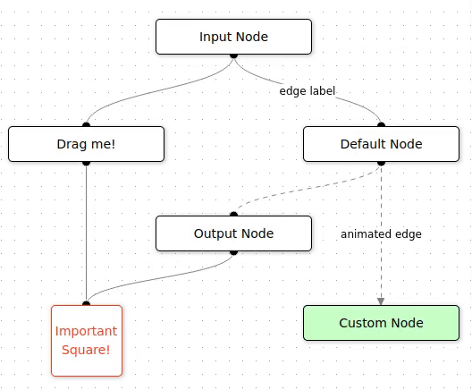

<div align="center">


# Simplify Diagramming with Svelvet!

Svelvet is a lightweight Svelte component library for building interactive node-based diagrams.

[⚡ Getting Started](https://svelvet.io/docs/installation/) | [📚 Documentation](https://svelvet.io/docs/core-concepts/) | [⌨️ Blog](https://medium.com/@alexander.zambrano/simplify-application-diagramming-with-svelvet-a8f664731243) | [💬 Twitter](https://twitter.com/svelvet_oslabs) | [💼 LinkedIn](https://www.linkedin.com/company/svelvet/)

</div>

## Key Features

- **Easy to use:** To get [started](https://svelvet.io/docs/basic-usage/) with Svelvet, all you need is the data for the nodes and edges you want to render
- **Customizable:** Svelvet provides developers the ability to customize their nodes and edges 
- **Fast rendering:** Nodes only re-render based on changes to their initial values
- **Reliable:** Svelvet is written with Typescript and is tested with [Playwright](https://playwright.dev/) and [Svelte Testing Library](https://testing-library.com/docs/svelte-testing-library/intro/)



## Installation 
Svelvet is available as both an npm and a yarn package. You can install it by running one of the two commands: 

```bash
npm install svelvet
```
```bash
yarn add svelvet
```

## Quick Start

Start by importing Svelvet into your application: 

```bash
import Svelvet from 'svelvet';
```
A Svelvet component consists of nodes and edges (or just nodes). You can pass nodes and edges as props to the Svelvet component. With the information that you provide for your nodes and edges, Svelvet will do all of the work behind-the-scenes to render your flowchart! 

```bash
<Svelvet nodes={nodes} edges={edges} />
```

Visit our [website](svelvet.io) to learn more on how to customize your nodes and edges to your liking! 

## Testing
Testing is done with Vitest and the Svelte Testing Library. You can find tests in the [/tests](https://github.com/oslabs-beta/Svelvet/tree/main/tests) folder. In order to run the tests use the command:
```bash
npm run test
```

## The Svelvet Team 

* Aaron Willett • [LinkedIn](https://www.linkedin.com/in/awillettnyc/) • [Github](https://github.com/awillettnyc)
* Alexander Zambrano • [LinkedIn](https://www.linkedin.com/in/alexander-z-8b7716b0/) • [Github](https://github.com/azambran21)
* Andrew Widjaja • [LinkedIn](https://www.linkedin.com/in/andrew-widjaja/) • [Github](https://github.com/andrew-widjaja)
* Anu Sharma • [LinkedIn](https://www.linkedin.com/in/anu-sharma-6936a686/) • [Github](https://github.com/anulepau)

## How to Contribute 
The following is a list of features and improvements for future open source developers. If you have any additional ideas, feel free to implement those as well!

- Custom error handling
- Increase test coverage for scalability 
- Interactive editing and controls
- Integration with mobile (click and drag nodes on your phone/tablet)
- More styling and customization of nodes and edges for complex Svelvet flow diagrams 
- Add a full stack feature to the documentation website with authentication and database that allows users to login, create and save their Svelvet diagrams 

## Credits

Inspired by [React Flow](reactflow.dev), Svelvet expands the tools available to Svelte developers and makes Svelte more inviting to both new and seasoned software engineers. Under the hood, Svelvet depends on the [d3-zoom](https://github.com/d3/d3-zoom) library to zoom and pan across the graph. 

## License

Svelvet is developed under the [MIT license](https://github.com/oslabs-beta/Svelvet/blob/main/LICENSE). 
