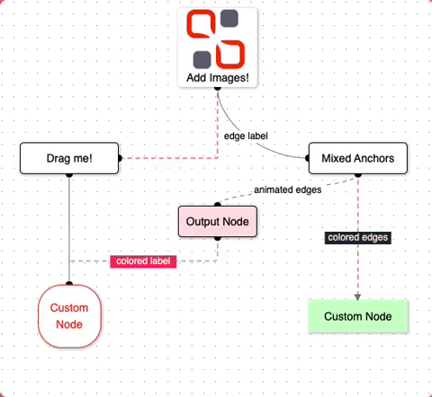

<div align="center">


# Simplify Diagramming with Svelvet!

Svelvet is a lightweight Svelte component library for building interactive node-based diagrams.

[⚡ Getting Started](https://svelvet.io/docs/installation/) | [📚 Documentation](https://svelvet.io/docs/core-concepts/) | [⌨️ Blog](https://medium.com/@MauricioACastro/svelvet-4-0-the-power-of-html-is-now-inside-your-nodes-3d96823096e3) | [💬 Twitter](https://twitter.com/svelvet_oslabs) | [💼 LinkedIn](https://www.linkedin.com/company/svelvet/)

</div>

## Version Updates

Shout out to our contributors! Here's what's new:

### Changelog

<details><summary>v6.0.0</summary>
<ul>
  <li>Added adaptive anchors. Anchors now automatically arrange themselves in an aesthetically pleasing way without user input. Adaptive anchors are now the default anchor mode.</li>
  <li>Added dynamic anchors. Anchors now automatically shift position when nodes are moved to preserve aesthetics.</li>
  <li>Added custom positioning of anchors. Users are able to specify custom positions of anchors using callbacks</li>
  <li>Added accessibiilty features for edges. Edges now highlight on hover to make edge interactions easier.</li>
  <li>Added functionality to resize nodes by dragging their bottom-right corner</li>
  <li>Added custom classes for edges to allow for uniform styling</li>
  <li>Added click event for edges that execute a user-defined callback</li>
  <li>Added functionality to edit edges by right-clicking on a node to bring up a modal</li>
  <li>Added feature to expand and collapse tree nodes. 
  <li>Updated documentation page on website to include new features</li>
  <li>Updated home page to include newest collaborators</li>
  <li>Solved github issue #s: </li>
</ul>
</details>

<details><summary>v5.0.0</summary>
<ul>
  <li>Now compatible with Safari (5.0.7 update)</li>
  <li>Added interactive node linking & creation</li>
  <li>Added ability to load custom Svelte components as nodes</li>
  <li>Added an optional minimap that allows you to visualize larger diagrams</li>
  <li>Added progammatic initial zoom and location</li>
  <li>Added custom classes for nodes to allow for uniform styling</li>
  <li>Added a feature that allows you to export and import diagrams</li>
  <li>Added an optional boundary to the diagram</li>
  <li>Added functionality to edit nodes by right-clicking on a node to bring up a modal</li>
  <li>Added an optional feature that allows users to delete nodes</li>
  <li>NOTE: Please make sure to give nodes and edges unique IDs to prevent forEach key duplicate error!</li>
  <li>Solved github issue #s: 65, 78, 80, 81, 85, 86, 104, 105, 146, 147, 148, 151, 153, 158</li>
  <li>Updated documentation page on website to include new features</li>
  <li>Updated home page to include newest collaborators</li>
</ul>
</details>
<details><summary>v4.0.0</summary>
<ul>
  <li>Added ability to include HTML in inside of nodes (i.e. videos, sounds, etc)</li>
  <li>Added NPM Package folder in root directory of GitHub repo</li>
  <li>this folder is used for adding changes to library & pushing updates to NPM; included here to have version control through GitHub</li>
  <li>Added snap-to-grid functionality for use during runtime in the canvas (GitHub Issue 107)</li>
  <li>Corrected issue where nodes become magnetized when moved outside of the visible canvas boundaries (GitHub Issues 120 & 125)</li>
  <li>Removed unused dotenv & node.env dependency from NPM Package package.json (GitHub Issue 118)</li>
  <li>Moved all dependancies in devDependancies to regular dependancies object, except for d3-zoom which is used by the client during runtime</li>
  <li>Added group nodes functionality</li>
  <li>Updated main website page to include newest set of collaborators</li>
  <li>Added CSS option for canvas background</li>
  <li>Added documentation for HTML in nodes, snap-to-grid, canvas background coloring, and node grouping to website documents</li>
  <li>General refactoring throughout application to improve responsiveness and decrease size</li>
  <li>Created documentation to assist future developers in understanding the flow of data in Svelvet and provide list of potential updates/upgrades</li>
</ul>
</details>
<details><summary>v3.0.0</summary>
<ul>
  <li>Added right-click context menu functionality on REPL playground page</li>
  <li>Added capability to add custom nodes and edges via context menu</li>
  <li>Added custom node/edge shortcuts for optimized user experience</li>
  <li>Incorporated dynamic addition of custom node/edge via predictive algorithm</li>
  <li>Added ability to copy text from code editor</li>
  <li>Node diagrams now have the option to be fixed in place</li>
  <li>Added tutorial overlay for REPL playground page</li>
  <li>Added ability to access quick view documentation via popup modal</li>
  <li>Updated documentation to allow easier contributor access('.env' file setup)</li>
  <li>Updated Community link on website to redirect to Svelvet thread on Stackoverflow</li>
  <li>Implemented skeleton codebase for a Community Forum with full database/route accessibility(for future contributors)</li>
</ul>
</details>
<details><summary>v2.0.2</summary>
<ul>
  <li>Added left and right anchor points</li>
  <li>Added step and smoothstep edge types</li>
  <li>Incorporated mixed edge functionality</li>
  <li>Refactored how edge text and labels render for every edge</li>
  <li>Fixed D3Zoom bias bug</li>
  <li>Expanded styling options, including label color, label background, and edge color</li>
  <li>Nodes are now able to contain images and will render differently based on the presence of label text</li>
  <li>Nodes are now draggable on touch screens and reposition themselves to center on your touch</li>
  <li>Implemented data reactivity</li>
  <li>Expanded TypeScripting</li>
  <li>Added E2E testing using Cypress</li>
  <li>Expanded unit tests</li>
  <li>Added a REPL to our documentation site</li>
  <li>Added SQL database to our REPL</li>
  <li>Added GitHub OAuth to enable users to save their custom diagrams created in our new REPL</li>
  <li>Expanded documentation for new features</li>
  <li>Added full CI/CD pipeline</li>
</ul>
</details>
<details><summary>v1.0.3</summary>
<ul>
  <li>Fixed bug with running tests</li>
  <li>Added ability to render multiple unique Svelvet components</li>
  <li>Added a 'clickCallback' customization option for nodes</li>
</ul>
</details>
<details><summary>v1.0.2</summary>
<ul>
  <li>Fixed bug with importing types for TypeScript applications</li>
  <li>Added a 'borderRadius' customization option for nodes</li>
  <li>Fixed SVG zoom/pan bug (zoom/pan is now limited to Svelvet component only)</li>
</ul>
</details>

## Key Features

- **Easy to use:** To get [started](https://svelvet.io/docs/basic-usage/) with Svelvet, all you need is data for nodes and edges. Visit our [documentation website](https://svelvet.io/) for streamlined, user-friendly tutorials and examples on how to get the most out of your Svelvet flowchart!
- **Interactive:** Elegant and smooth interface when selecting a node to drag it across the graph.
- **Customizable:** Ability to customize your nodes and edges (node size, color, border and edge type, label, anchor). More coming soon!
- **Fast rendering:** Re-rendering is based on changes to initial values for nodes, edges and optional background and _movement_ (collaborator credit to [dvisockas](https://github.com/dvisockas)).
- **Reliable:** Svelvet is written in TypeScript and tested with [Vitest](https://vitest.dev/), [Cypress](https://www.cypress.io/) and [Svelte Testing Library](https://testing-library.com/docs/svelte-testing-library/intro/). Svelvet is maintained by motivated engineers seeking to contribute to the larger Svelte developer community and library ecosystem.
- **Room to Grow:** There is so much we can do to improve, add features and make Svelvet the best version of itself - we welcome feedback and contributions! Scroll below for suggestions on what to contribute.



## Installation

Svelvet is available as both an npm and a yarn package. You can install it by running one of the two commands:

```bash
npm install svelvet
```

```bash
yarn add svelvet
```

## Quick Start

Start by importing Svelvet into your application:

```bash
import Svelvet from 'svelvet';
```

A Svelvet component consists of nodes and edges (or just nodes). You can pass nodes and edges as props to the Svelvet component. By default, Svelvet components allow for the ability to move nodes and edges as well as pan and zoom. However, if you would like to render a fixed diagram, simply pass in the movement attribute and set it's value to false! You can add a dot-grid background like the example below. With the information that you provide for your nodes and edges, Svelvet will do all of the work behind-the-scenes to render your flowchart!

```bash
<Svelvet nodes={nodes} edges={edges} movement background />
```

Visit our [website](https://svelvet.io) to learn more on how to customize your nodes and edges to your liking!

## Testing

Testing is done with Vitest and the Svelte Testing Library. You can find tests in the [/tests](https://github.com/open-source-labs/Svelvet/tree/main/tests) folder. In order to run the tests use the command:

For Unit testing

```bash
npm run test:unit
```

For End-to-End testing

```bash
npm run cypress:open
```

## The Svelvet Team

- Aaron Willett • [LinkedIn](https://www.linkedin.com/in/awillettnyc/) • [Github](https://github.com/awillettnyc)
- Alexander Zambrano • [LinkedIn](https://www.linkedin.com/in/alexander-z-8b7716b0/) • [Github](https://github.com/azambran21)
- Andrew Widjaja • [LinkedIn](https://www.linkedin.com/in/andrew-widjaja/) • [Github](https://github.com/andrew-widjaja)
- Anu Sharma • [LinkedIn](https://www.linkedin.com/in/anu-sharma-6936a686/) • [Github](https://github.com/anulepau)
- Justin Wouters • [LinkedIn](https://www.linkedin.com/in/justinwouters/) • [Github](https://github.com/justinwouters)
- Walter DeVault • [LinkedIn](https://www.linkedin.com/in/walter-devault/) • [Github](https://github.com/TensionCoding)
- Ali Adams • [LinkedIn](https://www.linkedin.com/in/alimadams/) • [Github](https://github.com/AliA12336)
- Von Garcia • [LinkedIn](https://www.linkedin.com/in/gerard-von-g-3964bb160/) • [Github](https://github.com/vongarcia97)
- Damian Lim • [LinkedIn](https://www.linkedin.com/in/lim-damian/) • [Github](https://github.com/limd96)
- Christopher Mander • [LinkedIn](https://www.linkedin.com/in/christopher-mander/) • [Github](https://github.com/cpmander)
- David Jakubiec • [LinkedIn](https://www.linkedin.com/in/david-jakubiec-16783384/) • [Github](https://github.com/davidjakubiec)
- Jeffrey Wentworth • [LinkedIn](https://www.linkedin.com/in/jeffreywentworth/) • [Github](https://github.com/jeffreywentworth)
- Johnny Tran • [LinkedIn](https://www.linkedin.com/in/tranpjohnny/) • [Github](https://github.com/JTraan)
- Samee Vohra • [LinkedIn](https://www.linkedin.com/in/sameev/) • [Github](https://github.com/sameev)
- Abhi Gullapalli • [LinkedIn](https://www.linkedin.com/in/viswa-gullapalli-442802253/) • [Github](https://github.com/aubertlone)
- Ian Hnizdo • [LinkedIn](https://www.linkedin.com/in/ian-hnizdo/) • [Github]()
- Mauricio Castro • [LinkedIn](https://www.linkedin.com/in/mauricioacastro/) • [Github](https://github.com/sher85)
- Ryan Potter • [LinkedIn](www.linkedin.com/in/ryan-potter-0105b6100) • [Github](https://github.com/rpotter0811)
- Emma Ferguson • [LinkedIn](https://www.linkedin.com/in/emma-ferguson-33858725a/) • [Github](https://github.com/emmanotly)
- Dillon McKenna • [LinkedIn](https://www.linkedin.com/in/dillon-mckenna/) • [Github](https://github.com/dmckenna44)
- Taylor Alan • [LinkedIn](https://www.linkedin.com/in/taylor-alan-026a49226/) • [Github](https://github.com/taylien96)
- Timmy Lem • [LinkedIn](https://www.linkedin.com/in/timmy-lem/) • [Github](https://github.com/timmylem01)
- Tony Lim • [LinkedIn](https://www.linkedin.com/in/tonylim467/) • [Github](https://github.com/tonyy467)
- Ernesto Gonzalez • [LinkedIn](www.linkedin.com/in/ernesto-gonzalez123) • [Github](https://github.com/ErnestoGonza)
- Michael Chiang • [LinkedIn](https://www.linkedin.com/in/michael-chiang-84509025b/) • [Github](https://github.com/michael-chiang-dev5)
- Rachel He • [LinkedIn](https://www.linkedin.com/in/rachel-he-8200563b/) • [Github](https://github.com/rachelheplus)
- Horacio Vallejo • [LinkedIn](https://www.linkedin.com/in/horacio-vallejo-100643187/) • [Github](https://github.com/horaciovallejo)

## Forking the Repository

If you'd like to fork the repository and run it locally, you'll need to perform a couple of steps to in order to get everything working properly:

- Create an account on [Supabase](https://supabase.com/)
- Create a new project in Supabase (you can name this whatever you want)
- Rename the 'supabase_env' file to '.env' and paste in the API keys from your newly created supabase project into the .env file

Once that is done you should be able to render the website locally on localhost:3000, although you will be missing some minor functionality tied to the production database (e.g. OAuth login).

## How to Contribute

Read `src/lib/doc/README.md` for suggestions on how to get started!

The following is a list of features and improvements by ourselves and the larger Svelte community for any open source developer to contribute. If you have any additional ideas, feel free to raise the issue or implement them as well!

- Premade node menu with drag & drop abilities
- Rotating of nodes
- Add documentation/video tutorial on how to set up a Svelvet demo
- Custom error handling
- Increase test coverage for scalability
- More styling and customization of edges for complex Svelvet flow diagrams
- Community Forum
- GET CREATIVE!! Svelvet is an amazing project that has so much room to grow.

## Credits

Inspired by [React Flow](https://github.com/wbkd/react-flow), Svelvet expands the tools available to Svelte developers and makes Svelte more inviting to both new and seasoned software engineers. Under the hood, Svelvet depends on the [d3-zoom](https://github.com/d3/d3-zoom) library to zoom and pan across the graph.

## License

Svelvet is developed under the [MIT license](https://github.com/open-source-labs/Svelvet/blob/main/LICENSE).
